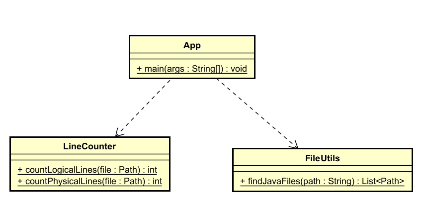

# LineCounter
## Author:
**Diego Armando Macia Diaz**
## Date:
**June 11th  2025**
## Class Diagram

## Description of the Class Diagram

## App
Main class of the program. Its `main` method starts the process by reading Java source files from the directory and applying the line-counting logic. It orchestrates the calls to `FileUtils` and `LineCounter`.

## LineCounter
Contains the logic for counting logical lines of code.

- `countLogicalLines(Path file)`: Opens and reads the file from the system, then delegates the counting.
- `countLogicalLines(List<String> lines)`: Receives lines already read from a file and processes them to count only non-empty and non-comment lines.

## FileUtils
Provides functionality to list `.java` files within a specific directory.

- `listJavaFiles(Path dir)`: Returns a list of all `.java` files found in the directory and its subdirectories.
